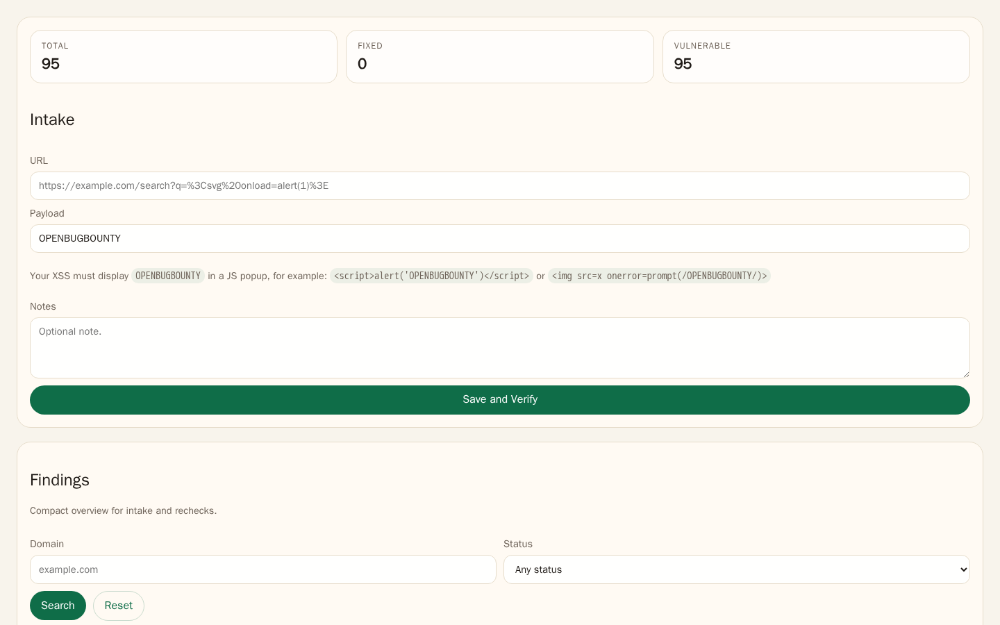
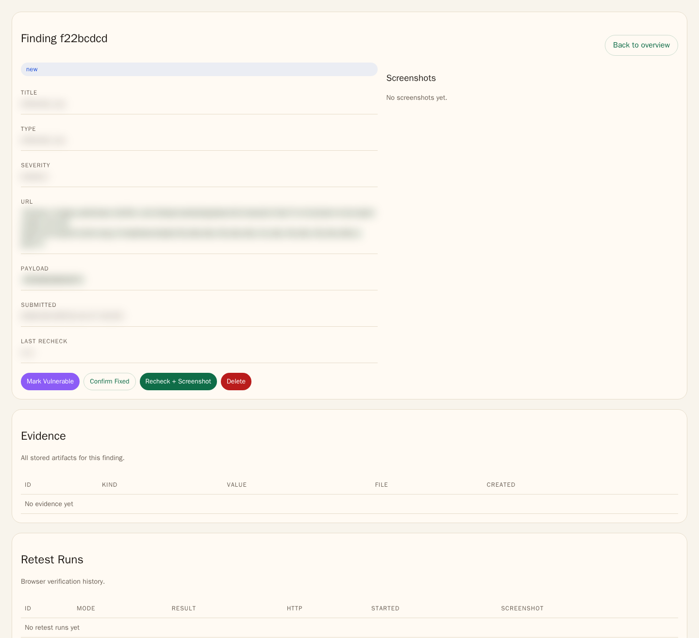

# LibreBugBounty

LibreBugBounty is a local, open-source OpenBugBounty alternative for reflected XSS triage.
It focuses on URL intake, automated browser verification, screenshot evidence, and a compact review workflow.
Later CRM features such as notification emails and a public interface can be added on top of this base.

If you are looking for terms that describe the project well, use:
reflected XSS, OpenBugBounty alternative, screenshot evidence, bug bounty CRM, and browser verification.

## Setup

```bash
ddev start
ddev composer install
```

The app stores its SQLite database and screenshots under `storage/` on the host machine.
That directory is intentionally ignored by Git.

If you start from a fresh or imported database, apply migrations once:

```bash
ddev exec php bin/console app:db:init
```

Open the UI:

```bash
open https://librebugbounty.ddev.site/
```

## Screenshots

Redacted previews of the current UI:





Regenerate both screenshots with:

```bash
ddev readme-screenshots
```

## Intake

Create a finding by submitting a URL in the web UI.
The app derives the domain automatically, runs browser verification, and stores screenshot evidence when available.

## Review Workflow

Run the screenshot-first review flow manually or from cron:

```bash
ddev exec php bin/console app:review:scan
```

Generate screenshots only for findings that are still missing them:

```bash
ddev screenshot-missing
```

Preview which findings would be processed:

```bash
ddev exec php bin/console app:review:scan --dry-run
```

The command processes findings that still need attention, runs Chromium and Firefox checks, and keeps `confirmed_fixed` findings terminal.

The overview is searchable by domain and status, and paginates after 50 findings per page.

## Reset

Reset only verification state while keeping the findings themselves:

```bash
ddev exec php bin/console app:reset:verification --force
```

For a full local MVP wipe:

```bash
ddev exec php bin/console app:reset:all --force
```

The verification reset clears screenshots, evidence records, retest runs, and review state, then returns findings to `new`.
The full reset does the same and is the more destructive maintenance command for a completely clean slate.

## What You Get

- URL-only intake
- automatic domain derivation
- browser verification with screenshot capture
- manual review states for `manual_checking` and `confirmed_fixed`
- a compact overview table with `ID`, `Domain`, `Status`, `Submitted`, and `Last Recheck`
- host-local SQLite and artifacts under `storage/`

## Tests

```bash
ddev exec vendor/bin/phpunit
```
