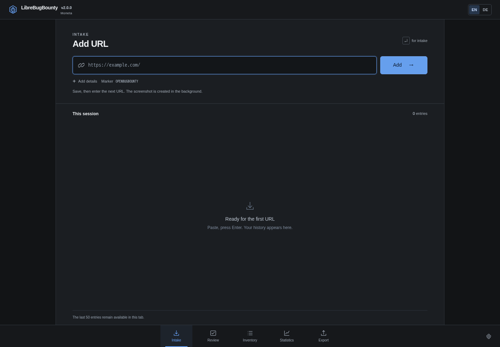
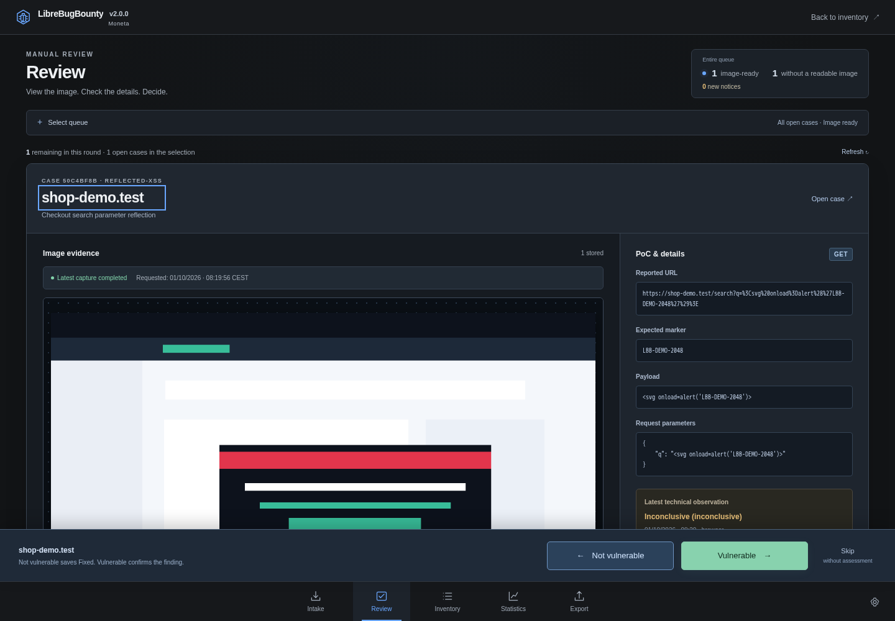
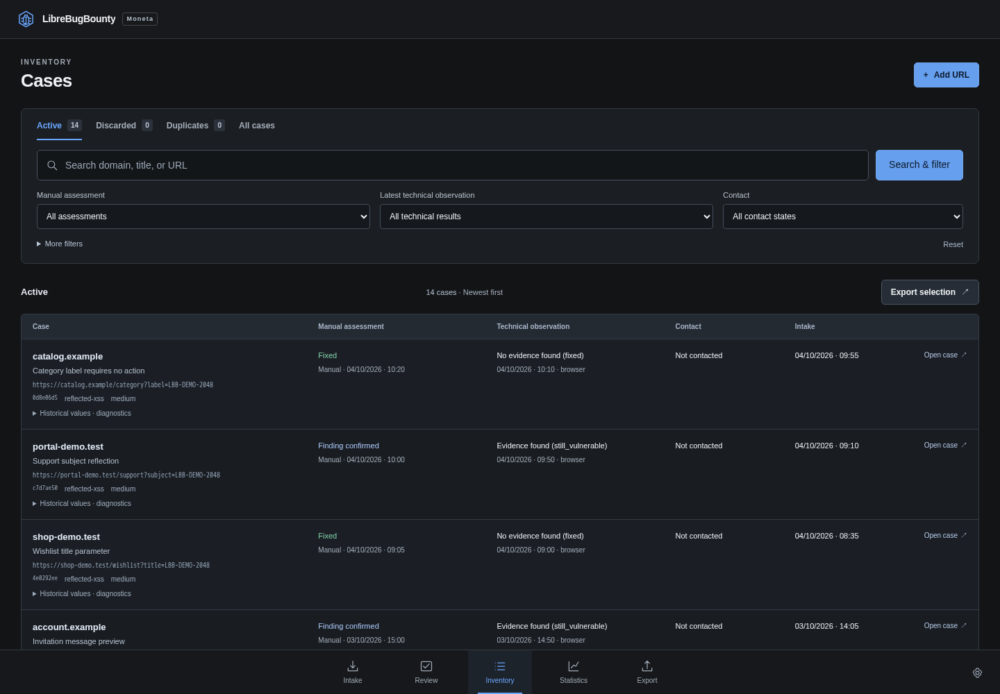
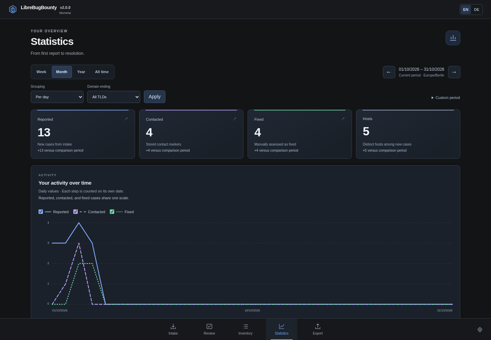
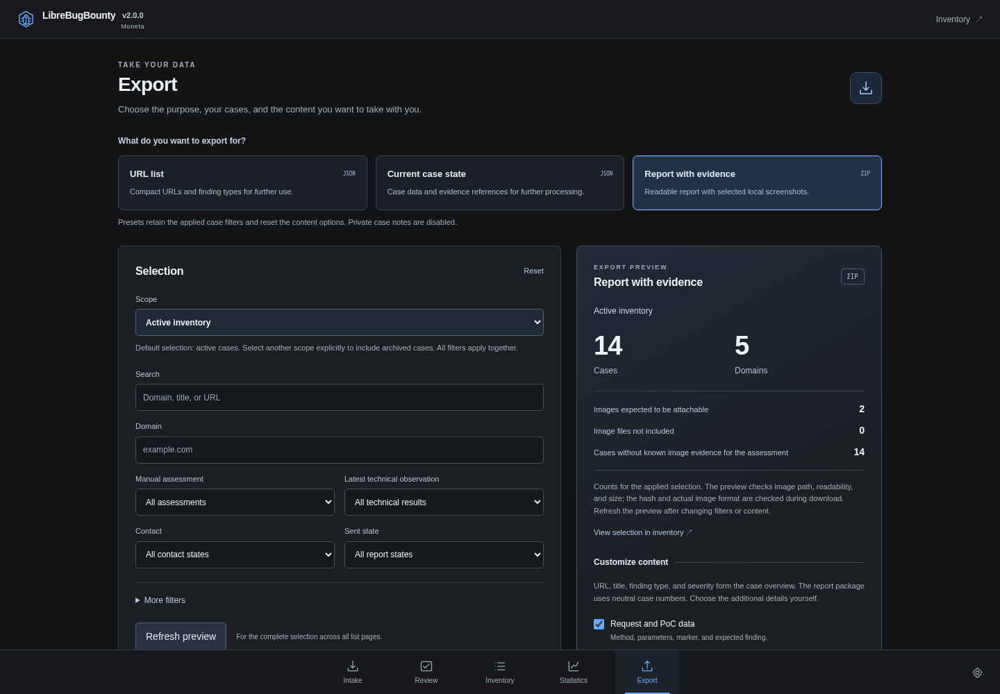

# LibreBugBounty 2.0.2 “Moneta”

**A self-hosted bug bounty workspace for reflected XSS research — an
open-source, local-first OpenBugBounty alternative.**

LibreBugBounty turns a stream of candidate URLs into a reviewable local case
file for vulnerability triage and responsible disclosure. It stores intake
durably, captures browser evidence in the background, keeps technical
observations separate from your manual decision, and exports the result when
you are ready to report it.

- **Intake:** fast URL capture with duplicate detection and background
  Chromium screenshots
- **Triage:** evidence-first review with keyboard, touch, and decision pause
- **Maintenance:** parallel automatic rechecks on a configurable cadence,
  with worker health monitoring
- **Disclosure:** searchable inventory, contact history, activity
  statistics, and evidence-ready ZIP exports

**Stack:** PHP · Symfony · SQLite · Playwright/Chromium · DDEV — everything
stays on your machine.

The application runs on your own machine and is designed for a focused,
single-user workflow. LibreBugBounty is independent of and not affiliated with
OpenBugBounty.

LibreBugBounty currently concentrates on reflected XSS triage. It does not send
disclosure emails or submit reports for you.

## Quick start

You need [Docker](https://docs.docker.com/engine/install/),
[DDEV](https://ddev.readthedocs.io/en/stable/users/install/ddev-installation/),
and Git.

```bash
git clone https://github.com/tfgrass/librebugbounty.git
cd librebugbounty
ddev start
ddev launch
```

`ddev start` installs the locked Composer dependencies, initializes or migrates
the SQLite schema, and starts the supervised screenshot worker. Repeated starts
preserve existing data. The database and evidence live below `storage/`, which
is ignored by Git.

## First use

Follow the workflow below. Each screenshot opens at full size.

### Capture URLs

**Intake** saves candidate URLs to SQLite, detects duplicates, and queues
Chromium screenshots in the background. Cases are stored before browser work
begins, and earlier evidence stays available.

<p>
  <a href="docs/screenshots/intake.png"></a>
</p>

### Review screenshots

**Review** puts the evidence first: the image fits the window, details scroll
separately, and the arrow-key controls stay visible. Choose **Vulnerable** or
**Not vulnerable**, skip, open the stored PoC URL, or go back and reset a decision.
An optional decision pause helps prevent accidental classifications.

<p>
  <a href="docs/screenshots/review.png"></a>
</p>

### Manage cases

**Inventory** searches domains, titles, and URLs. Filter cases, record private
notes and completed contacts, and request rechecks or new screenshots.
Opening a case never starts browser work.

**Follow-up** (2.0.2) separates “Do not pursue” and explicit case/domain
contact/check opt-outs from the factual assessment. Manual **security.txt contact
discovery** retains sourced email and disclosure-portal suggestions; it never
sends messages. Follow-up statistics expose sample sizes and missing dates.
See [usage](USAGE.md#follow-up-and-contact-suggestions-202) and the
[internal provider/deployment notes](ENRICHMENT.md). Hunter.io, AI and arbitrary
plugins are not implemented.

**My views** saves named filter combinations for quick access to the current
matching cases. **Recent views** keeps the last ten applied combinations in your
browser; promote one to a saved view or clear the local history at any time.

<p>
  <a href="docs/screenshots/inventory.png"></a>
</p>

Case details keep your manual assessment separate from technical observations,
including later contradictions, inconclusive results, and errors. Earlier
images and judgments remain in the history.
[View the case-detail screenshot](docs/screenshots/finding-detail.png).

### Follow activity

**Statistics** opens with the **last three months**, through today. Follow
**Reported**, **Contacted**, and **Fixed**, or choose a week, month, year, all-time,
or custom period. Group activity by day, week, or month, then open the matching
cases from the chart or calendar.

<p>
  <a href="docs/screenshots/statistics.png"></a>
</p>

### Prepare reports

**Export** creates a compact URL list, current case-state JSON, or a
self-contained ZIP report. The default is **Report with evidence**: a readable
report, structured domains and cases, and the latest stored screenshot per
case. Choose the contents and image selection before downloading; private
notes are included only when explicitly selected.

<p>
  <a href="docs/screenshots/export.png"></a>
</p>

### Choose defaults and find help

**Settings & info** saves your preferred inventory page size, export profile,
and report screenshot selection, alongside the intake marker, browser timeout,
and review pause. Explicit choices on the workspace pages take precedence.
[View the Settings & info screenshot](docs/screenshots/about.png).

The interface starts in English. Choose **DE** or **EN** in the header; your
browser remembers the language across pages and visits. The [user guide](USAGE.md)
covers controls, settings, and troubleshooting. The guide, installation,
backup instructions, [changelog](CHANGELOG.md), and [roadmap](ROADMAP.md) are
also available offline under **Settings & info → Documentation**.

## Upgrade an existing workspace

1. Create and verify a [complete backup](BACKUP.md) before upgrading. Keep the
   database and artifact tree from the same snapshot together.
2. Run `ddev stop` to stop the application and its background workers.
3. Update the checkout to the published release you want to use, preserving
   any local configuration changes. Release versions are listed in the
   [changelog](CHANGELOG.md).
4. If your existing installation uses custom database or artifact paths, carry
   both into `DATABASE_URL` and `EVIDENCE_STORAGE_DIR` under `web_environment` in
   `.ddev/config.yaml`, using paths inside the container. Moneta explicitly sets
   these variables there, so previous `.env` values alone no longer select your
   storage. Keep the database and artifact tree from the same workspace together.
   The backup tool needs their corresponding host paths; see
   [custom installation paths](BACKUP.md#custom-installation-paths).
5. Remove the generated `playwright-worker/node_modules/` directory, if present,
   while DDEV is stopped. The next start recreates it from the committed lockfile
   so the worker dependencies match the release's browser image.
6. Run `ddev start`. Startup installs the locked Composer and worker
   dependencies, applies pending database migrations, and starts the workers.
7. Check that your existing cases, notes, assessments, and images are available.

An upgrade preserves the stored workspace; it does not require a database
reset. If you need to return to the earlier application version, use the
matching pre-upgrade database and artifact snapshot in a separate recovery
directory. Follow [the recovery instructions](BACKUP.md#restore-into-a-new-directory)
instead of pointing older application code at an upgraded database.

## Backup

Create and validate a private local snapshot with Python 3.11 or newer:

```bash
python3 bin/backup-local.py create
```

The command briefly pauses this project's DDEV containers, copies SQLite and
the artifact tree consistently, resumes the project, and verifies a separate
restoration. It never overwrites the live database. By default snapshots are
written to `~/.local/share/librebugbounty/backups/`.

See [backup and recovery](BACKUP.md) for verification, custom storage paths, and
restoring into a new directory without replacing existing data. A JSON or ZIP
export is a reporting format; use a backup to preserve the complete case history.

## Operating boundary

LibreBugBounty has no login or multi-user permission model. Keep it on a trusted
local machine and do not publish its web or Playwright services to the internet.
Only test systems for which you have authorization.

## Development checks

```bash
ddev exec vendor/bin/phpunit
npm --prefix playwright-worker ci --no-audit --no-fund
npm --prefix playwright-worker test
python3 -B -m unittest discover -s tests -p 'backup_local_test.py' -v
```

CI also runs a Studio browser smoke test with disposable storage and mocked
browser-health services. It covers eight preferences, DE/EN, narrow windows,
native forms without JavaScript, partial or unavailable worker states, retained
image comparison and the deduplicated error overview. Synthetic stored records
exercise diagnostics without contacting targets or queuing capture work.
With native PHP 8.3+ (including `pdo_sqlite` and `zip`), Node.js and Python 3.11+
installed, run the same smoke suite locally:

```bash
./playwright-worker/node_modules/.bin/playwright install --with-deps chromium
python3 tests/browser/run_preferences.py
```

The runner starts its own loopback server, removes its temporary database on
exit, and keeps screenshots and logs under `var/preferences-acceptance-*`.

The README screenshots are generated from a disposable synthetic database and
artifact directory. The command never reads the normal `storage/` tree:

```bash
ddev readme-screenshots
```

## Credits and license

Created by [Tom Graßmann IT+Media](https://grassmann-it.de/). OpenBugBounty:
[grassmann-it](https://www.openbugbounty.org/researchers/grassmann-it/).
Proudly vibe-coded.

LibreBugBounty is free software licensed under the
[GNU General Public License v3.0 or later](LICENSE). Copyright © 2026 Tom
Graßmann IT+Media.
