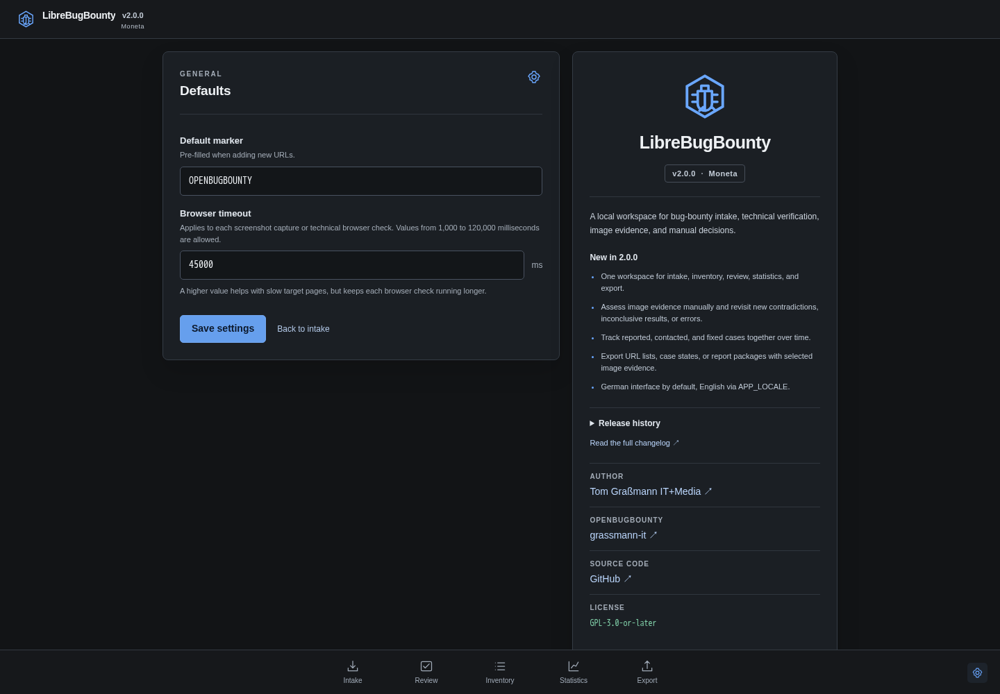

# LibreBugBounty 2.0.0 “Moneta”

**A local-first OpenBugBounty alternative for reflected XSS research.**

LibreBugBounty turns a stream of candidate URLs into a reviewable local case
file. It stores intake durably, captures browser evidence in the background,
keeps technical observations separate from your manual decision, and exports
the result when you are ready to report it.

The application runs on your own machine and is designed for a focused,
single-user workflow. LibreBugBounty is independent of and not affiliated with
OpenBugBounty.

## Your local workspace

<p align="center">
  <a href="docs/screenshots/review.png"></a>
</p>
<p align="center">
  <a href="docs/screenshots/inventory.png"></a>
  <a href="docs/screenshots/finding-detail.png"></a>
  <a href="docs/screenshots/statistics.png"></a>
</p>

Capture new URLs on Intake, choose the contents of a report on Export, and
explore the project history in About:

<p align="center">
  <a href="docs/screenshots/intake.png"></a>
  <a href="docs/screenshots/export.png"></a>
  <a href="docs/screenshots/about.png"></a>
</p>

## What it does

- Fast URL intake with durable SQLite storage and duplicate detection
- A persistent Chromium screenshot queue with retained evidence history
- Image-first manual review with keyboard, touch, and native form controls
- Separate manual assessments and technical observations, including later
  contradictions, inconclusive results, and errors
- Searchable case inventory, case notes, evidence, rechecks, and screenshot
  actions
- Weekly, monthly, yearly, all-time, and custom activity statistics, grouped by
  day, week, or month
- Configurable JSON exports and self-contained ZIP report packages with selected
  evidence
- Local backups that keep the database and artifact tree together
- English and German UI with a language switcher in the header

LibreBugBounty currently concentrates on reflected XSS triage. It does not send
disclosure emails or submit reports for you.

## Quick start

You need [Docker](https://docs.docker.com/engine/install/),
[DDEV](https://ddev.readthedocs.io/en/stable/users/install/ddev-installation/),
and Git.

```bash
git clone https://github.com/tfgrass/librebugbounty.git
cd librebugbounty
ddev start
ddev launch
```

`ddev start` installs the locked Composer dependencies, initializes or migrates
the SQLite schema, and starts the supervised screenshot worker. Repeated starts
preserve existing data. The database and evidence live below `storage/`, which
is ignored by Git.

## Upgrade an existing workspace

1. Create and verify a [complete backup](BACKUP.md) before upgrading. Keep the
   database and artifact tree from the same snapshot together.
2. Run `ddev stop` to stop the application and its background workers.
3. Update the checkout to the published release you want to use, preserving
   any local configuration changes. Release versions are listed in the
   [changelog](CHANGELOG.md).
4. If your existing installation uses custom database or artifact paths, carry
   both into `DATABASE_URL` and `EVIDENCE_STORAGE_DIR` under `web_environment` in
   `.ddev/config.yaml`, using paths inside the container. Moneta explicitly sets
   these variables there, so previous `.env` values alone no longer select your
   storage. Keep the database and artifact tree from the same workspace together.
   The backup tool needs their corresponding host paths; see
   [custom installation paths](BACKUP.md#custom-installation-paths).
5. Remove the generated `playwright-worker/node_modules/` directory, if present,
   while DDEV is stopped. The next start recreates it from the committed lockfile
   so the worker dependencies match the release's browser image.
6. Run `ddev start`. Startup installs the locked Composer and worker
   dependencies, applies pending database migrations, and starts the workers.
7. Check that your existing cases, notes, assessments, and images are available.

An upgrade preserves the stored workspace; it does not require a database
reset. If you need to return to the earlier application version, use the
matching pre-upgrade database and artifact snapshot in a separate recovery
directory. Follow [the recovery instructions](BACKUP.md#restore-into-a-new-directory)
instead of pointing older application code at an upgraded database.

## First use

1. Add a candidate URL on **Intake**. Its screenshot is queued in the background.
2. Open **Review** to inspect the evidence and choose **Vulnerable** or
   **Not vulnerable**.
3. Use **Inventory** to find cases, record notes and completed contacts, and
   inspect their history.
4. Follow **Reported**, **Contacted**, and **Fixed** together in **Statistics**.
5. Choose a URL list, case-state JSON, or a report package on **Export**.

Opening a case never starts browser work. A screenshot is evidence; your manual
assessment and a saved technical observation remain separate.

The interface starts in English. Choose **DE** or **EN** in the header to switch
languages; your browser remembers the choice across pages and visits.

Read the [user guide](USAGE.md) for review controls, export choices, settings,
and troubleshooting. The [changelog](CHANGELOG.md) covers the first Scriptor
prototype, the Scriptor Quo refinements, and the new Moneta workspace.
These English documents are also available inside the application under
**Settings & info → Documentation**, including when you are offline.

The [roadmap](ROADMAP.md) outlines future directions for database portability,
email workflows, and optional AI assistance.

## Backup

Create and validate a private local snapshot with Python 3.11 or newer:

```bash
python3 bin/backup-local.py create
```

The command briefly pauses this project's DDEV containers, copies SQLite and
the artifact tree consistently, resumes the project, and verifies a separate
restoration. It never overwrites the live database. By default snapshots are
written to `~/.local/share/librebugbounty/backups/`.

See [backup and recovery](BACKUP.md) for verification, custom storage paths, and
restoring into a new directory without replacing existing data. A JSON or ZIP
export is a reporting format; use a backup to preserve the complete case history.

## Operating boundary

LibreBugBounty has no login or multi-user permission model. Keep it on a trusted
local machine and do not publish its web or Playwright services to the internet.
Only test systems for which you have authorization.

## Development checks

```bash
ddev exec vendor/bin/phpunit
npm --prefix playwright-worker ci --no-audit --no-fund
npm --prefix playwright-worker test
python3 -B -m unittest discover -s tests -p 'backup_local_test.py' -v
```

The README screenshots are generated from a disposable synthetic database and
artifact directory. The command never reads the normal `storage/` tree:

```bash
ddev readme-screenshots
```

## Credits and license

Created by [Tom Graßmann IT+Media](https://grassmann-it.de/). OpenBugBounty:
[grassmann-it](https://www.openbugbounty.org/researchers/grassmann-it/).
Proudly vibe-coded.

LibreBugBounty is free software licensed under the
[GNU General Public License v3.0 or later](LICENSE). Copyright © 2026 Tom
Graßmann IT+Media.
