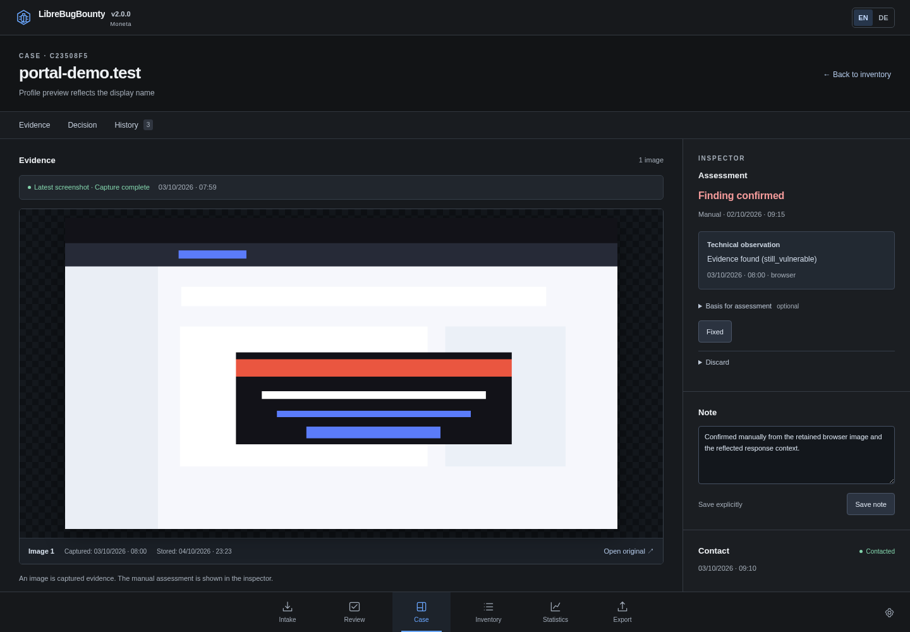

# LibreBugBounty

**A local-first OpenBugBounty alternative for reflected XSS research.**

LibreBugBounty turns a stream of candidate URLs into a reviewable local case
file. It stores intake durably, captures browser evidence in the background,
keeps technical observations separate from your manual decision, and exports
the result when you are ready to report it.

The application runs on your own machine and is designed for a focused,
single-user workflow. LibreBugBounty is independent of and not affiliated with
OpenBugBounty.

## Studio

<p align="center">
  <a href="docs/screenshots/review.png"></a>
</p>
<p align="center">
  <a href="docs/screenshots/inventory.png"></a>
  <a href="docs/screenshots/finding-detail.png"></a>
  <a href="docs/screenshots/statistics.png"></a>
</p>

## What it does

- Fast URL intake with durable SQLite storage and duplicate detection
- A persistent Chromium screenshot queue with retained evidence history
- Image-first manual review with keyboard, touch, and native form controls
- Separate manual assessments and technical observations, including later
  contradictions, inconclusive results, and errors
- Searchable case inventory, case notes, evidence, rechecks, and screenshot
  actions
- Daily, weekly, monthly, yearly, and all-time activity statistics
- Configurable JSON exports and self-contained ZIP report packages with selected
  evidence
- Local backups that keep the database and artifact tree together
- German and English UI selected through `APP_LOCALE`

LibreBugBounty currently concentrates on reflected XSS triage. It does not send
disclosure emails or submit reports for you.

## Workflow

1. Paste a candidate URL into the intake page at `/`.
2. The case and its screenshot job are committed before the request succeeds.
3. Review unresolved cases at `/review` and mark them **Vulnerable** or
   **Not vulnerable**.
4. Use `/findings` and the case detail to inspect history, add notes, enqueue a
   fresh screenshot, or run an explicit technical recheck.
5. Track progress at `/statistics` and prepare data or evidence packages at
   `/export`.

Opening a case never starts browser work. Screenshots and rechecks only run when
they were queued or explicitly requested.

## Quick start

You need [Docker](https://docs.docker.com/engine/install/),
[DDEV](https://ddev.readthedocs.io/en/stable/users/install/ddev-installation/),
and Git.

```bash
git clone https://github.com/tfgrass/librebugbounty.git
cd librebugbounty
ddev start
ddev launch
```

`ddev start` installs the locked Composer dependencies, initializes or migrates
the SQLite schema, and starts the supervised screenshot worker. Repeated starts
preserve existing data. The database and evidence live below `storage/`, which
is ignored by Git.

Useful checks:

```bash
ddev describe
ddev exec supervisorctl status webextradaemons:screenshot-queue
ddev exec curl -fsS http://playwright:3000/health
ddev exec php bin/console app:artifacts:audit
```

Queue screenshots without changing manual or technical assessments:

```bash
ddev exec php bin/console app:screenshot:missing --dry-run
ddev exec php bin/console app:screenshot:missing --limit=1000
```

## Language

German is the default and fallback. Set `APP_LOCALE=en` for English. With DDEV,
put the setting in a local override and restart the project:

```yaml
# .ddev/config.local.yaml
web_environment:
  - APP_LOCALE=en
```

```bash
ddev restart
```

Use `APP_LOCALE=de` to select German explicitly. Stored case data is never
translated or rewritten when the interface language changes.

## Backup

Create and validate a private local snapshot with Python 3.11 or newer:

```bash
python3 bin/backup-local.py create
```

The command briefly pauses this project's DDEV containers, copies SQLite and
the artifact tree consistently, resumes the project, and verifies a separate
restoration. It never overwrites the live database. By default snapshots are
written to `~/.local/share/librebugbounty/backups/`.

## Operating boundary

LibreBugBounty has no login or multi-user permission model. Keep it on a trusted
local machine and do not publish its web or Playwright services to the internet.
Only test systems for which you have authorization.

## Development checks

```bash
ddev exec vendor/bin/phpunit
npm --prefix playwright-worker ci --no-audit --no-fund
npm --prefix playwright-worker test
python3 -B -m unittest discover -s tests -p 'backup_local_test.py' -v
```

The README screenshots are generated from a disposable synthetic database and
artifact directory. The command never reads the normal `storage/` tree:

```bash
ddev readme-screenshots
```

## Credits and license

Created by [Tom Graßmann IT+Media](https://grassmann-it.de/). OpenBugBounty:
[grassmann-it](https://www.openbugbounty.org/researchers/grassmann-it/).
Proudly vibe-coded.

LibreBugBounty is free software licensed under the
[GNU General Public License v3.0 or later](LICENSE). Copyright © 2026 Tom
Graßmann IT+Media.
