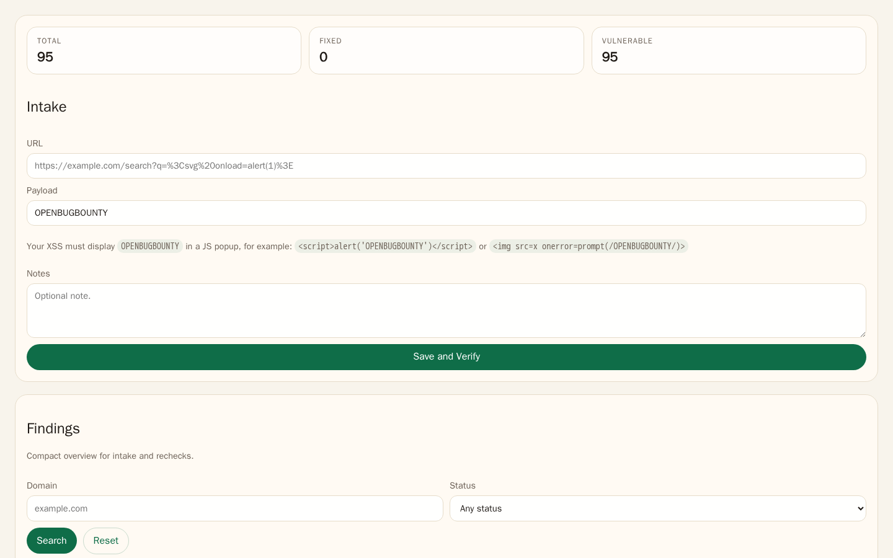
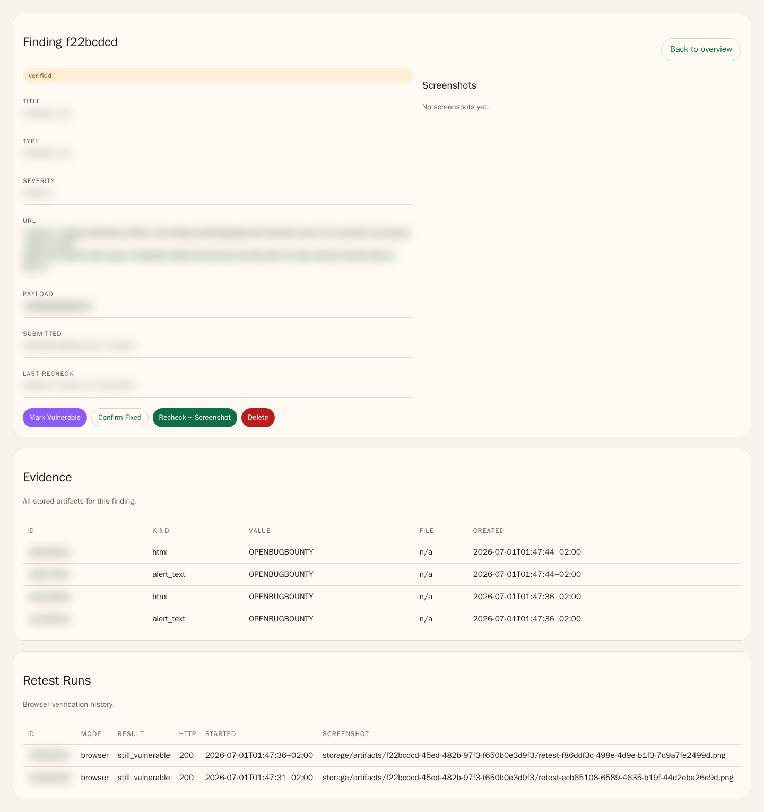

# LibreBugBounty

LibreBugBounty is a local, open-source OpenBugBounty alternative for reflected
XSS triage. It combines fast durable URL intake, persistent screenshot jobs,
evidence history, explicit technical checks, and a compact review workflow.

## Screenshots

<a href="docs/screenshots/overview-redacted.png">
  
</a>
<a href="docs/screenshots/detail-redacted.png">
  
</a>

## Setup and operation

```bash
ddev start
ddev launch
```

The DDEV post-start hook installs Composer dependencies, applies the SQLite
migrations with `app:db:init`, and starts one supervised
`app:screenshot:worker`. The Playwright sidecar starts its own Xvfb display and
reports its readiness through `GET /health`.

The versioned DDEV configuration supplies its local `APP_SECRET`, SQLite
`DATABASE_URL`, and `EVIDENCE_STORAGE_DIR`; a fresh checkout does not depend on an
ignored local `.env` file. The sidecar image, Node manifest, and committed lock
file all pin Playwright `1.61.1`, so its startup can use reproducible `npm ci`.

Useful operational checks:

```bash
ddev describe
ddev exec supervisorctl status webextradaemons:screenshot-queue
ddev exec pgrep -af 'app:screenshot:worker'
ddev exec curl -fsS http://playwright:3000/health
```

The app stores its SQLite database and artifacts under `storage/` on the host.
That directory is intentionally ignored by Git. If a migration ever needs to be
run separately, use:

```bash
ddev exec php bin/console app:db:init
```

## Fast intake, verification, and screenshots

Open `/` for the compact, dark Studio intake workspace. It is designed for a
half-width window beside a list of URLs: paste one URL, press Enter, then continue
after storage is confirmed. Optional marker and note fields sit under details;
the session history shows compact storage and screenshot states.

Open `/findings` for the Studio inventory. Search matches literal text in the
domain, title, and full URL, including punctuation such as `%` and `_`. Combine
it with assessment, latest observation, contact, archive, and diagnostic filters.
Filter state and paging live in the URL and survive opening a case, saving its
notes/assessment/contact, and returning to the list. Global counters open the
exact counted selection and reset other filters. At half width the rows become
cards with independent assessment, observation, and contact fields.

Open `/export` for a JSON download of the current case state. The inventory's
export link carries its complete filter selection across all list pages.
Preview case/domain counts, choose an archive scope explicitly when needed, and
include private case notes only by opting in. The download keeps manual
assessment, latest technical observation, contact, and first-send timestamps
separate, and includes evidence metadata and local artifact links. Image files
and complete histories are outside this export; consistent database/artifact
backups remain available separately.

The classic overview remains at `/legacy`, with classic details at
`/legacy/findings/{id}` and settings at `/legacy/settings`.
The former operator-priority page and its HTML export have been removed.
Both surfaces share list/detail services and
business rules. Switching intake surfaces in the same tab retains the current
draft and up to 50 entries. History, toast links, and overview rows open the
Studio detail at `/findings/{id}`. Each detail links to the same finding in the
other surface.

Former `/studio` and `/studio/findings...` bookmarks redirect to canonical Studio
routes. Old filtered root links redirect to `/findings` with their parameters;
old settings GET links redirect under `/legacy`. Symfony also normalizes
trailing slashes. POST, JSON API, and artifact URLs remain unchanged.

The Studio detail uses a large evidence area and a compact inspector for manual
assessment, notes, and contact. Windows up to 1100 CSS pixels stack those areas;
the `Beleg`, `Entscheidung`, and `Verlauf` links reach them directly. Multiple
images can be selected, and the original local artifact opens at full size.
Without JavaScript, all retained images and the native forms remain usable.
Capture time and storage time are separate. Missing files and the latest queued,
running, failed, or completed screenshot job remain visible alongside older
images, including browser-protection metadata.

The Studio inspector also offers permanent deletion under `Fallverwaltung`.
Expand the section and explicitly confirm removal of the case and its evidence.
The native form works without JavaScript and returns to the validated list
context after deletion. Opening the confirmation leaves the case untouched.

Classic and Studio read the same detail projection and use the same assessment
and contact operations. The selected image is not automatically recorded as an
assessment basis. Notes are explicitly saved with the CSRF-protected
`POST /findings/{id}/notes` form; there is no autosave. The collapsed technical
history shows assessments with their explicit basis, screenshot jobs, evidence,
and the 20 most recent technical observations. Opening either detail view starts
no retest or capture. Image comparison remains future work.

Open `/review` from the bottom navigation for manual review of unresolved cases.
The supply includes active cases without a recorded manual assessment whose
latest observation is inconclusive, an error, or absent, and new review notices
for assessed cases. A notice appears only for a contradictory result, an
inconclusive result, or an error; matching results do not reopen review. Available screenshots
are shown by default; filters expose cases with missing images and each technical
reason separately. The large image, stored URL/request data, marker, and notes
are visible together. Selecting an image does not select an assessment basis.

The right action, **Vulnerable**, records `confirmed`; the left action,
**Not vulnerable**, records `fixed` (confirmed fixed). Both move to the next case
after a successful save. Arrow keys and touch gestures use the same left/right
decisions. A smaller, separate Skip link changes no case data and advances through
the current pass; the case can reappear when restarting. Discard remains a
separate explicit action that archives the case. Native forms work without JavaScript.
Stale submissions cannot overwrite a newer decision. The last reviewed case can
be opened in the full detail to correct its assessment. Opening review starts no
browser or screenshot work. The **Neue Hinweise** filter selects previously
assessed cases with unresolved notices. Every triggering observation is shown,
even when a later matching result exists. **Geprüft · Bewertung behalten** records
an immutable acknowledgement without changing the finding, its assessment date,
contact state, or assessment history. A later qualifying observation reopens the
notice. The full detail shows acknowledgement history and uses the same notice
policy. Persistent deferral and image comparison remain future work.

Submitting a supported URL stores the finding and its first persistent screenshot
job atomically in one database transaction. A committed new finding therefore
cannot be left without its initial capture work. An exact duplicate URL is not
imported or verified again; the UI links to the existing finding and keeps its
notes and history unchanged. If an older finding has no screenshot-job history,
that duplicate submission repairs the missing initial job. Existing terminal or
active jobs are not replaced.

The intake response returns after that durable database commit. It does not wait
for the screenshot worker and does not start an automatic headless retest. This
revises the earlier immediate-verification behavior, which could block a request
for up to 120 seconds and could fail to settle on pages that repeatedly open
dialogs. Manual and other explicitly selected retest commands remain available
as separate operations.

The existing page submits one URL at a time to `POST /api/findings`. A newly
stored finding returns HTTP 201; an exact duplicate returns HTTP 200. Both include
the finding ID, detail link, and current persisted status. Validation errors use
HTTP 422 and invalid CSRF tokens use HTTP 403. The classic `POST /findings` route
uses the same storage operation and redirects without running a retest.

After confirmed storage, unchanged URL and note fields are cleared and the URL
field is focused for the next entry. If the next draft is already being edited,
its values and active field are preserved. The current tab keeps up to 50
submissions and the current draft in `sessionStorage`, so they survive a reload.
Failed or unconfirmed requests remain available for an explicit retry; an unknown
response never triggers an automatic second POST.
Status toasts appear only in the visible, focused tab and restored old states do
not generate new toasts after reload.

`GET /api/findings/status?ids[]=...` reads the persisted state of at most 50
finding IDs. It reports existing manual assessment, latest stored technical
observation, contact time, and screenshot-job state. This polling endpoint starts
neither a retest nor a screenshot. The narrow JSON interface initially serves the
classic and Studio pages; it is not a general public API.

The supervised screenshot worker separately opens a headed Chromium instance and
stores a screenshot. A successful intake therefore confirms the finding and
queued capture work, not a technical vulnerability result or an available image.

The separate capture always produces an image when it succeeds:

- `desktop-dialog` contains the page and a real, still-open Chromium dialog.
- `desktop-page` contains the visible page when no dialog appears, including for
  findings whose technical result is `inconclusive`.

The Xvfb desktop is 1440x900. Visible browser work is serialized both by the
Symfony worker and by a FIFO lease in the Node process because all headed
browsers share that display.

Screenshot jobs move through these persisted states:

| State | Meaning |
| --- | --- |
| `queued` | Waiting for the worker. No screenshot is claimed yet. |
| `running` | Claimed by the worker; capture is in progress. |
| `available` | Image, evidence row, capture time, and metadata were saved. |
| `failed` | Capture or persistence failed; the detail view shows the reason. |

Only one `queued` or `running` job can exist per finding. Terminal jobs remain as
history and a new job can then be queued. FIFO order is based on request order.
Queue insertion rechecks the finding inside the queue lock and uses
`INSERT ... SELECT` from the live `finding` row. A stale entity reference after a
concurrent deletion is rejected and cannot create an orphaned job even though
SQLite foreign-key enforcement is disabled.
If DDEV stops during capture, the job is returned to the queue at worker startup.
After three interrupted attempts it becomes `failed` so later work can continue.
A Playwright sidecar that is still starting leaves work queued instead of claiming
it.

The finding detail shows the job history, request/start/capture times, failures,
and all retained images. Screenshot processing does not change the finding
status, review state, notes, contact fields, `lastRetestedAt`, or retest history.

Queue screenshots without running a technical retest:

```bash
# Findings that do not have screenshot evidence
ddev exec php bin/console app:screenshot:missing --limit=1000

# Same default selection; --recreate queues new captures even when evidence exists
ddev exec php bin/console app:screenshot:all --limit=1000
ddev exec php bin/console app:screenshot:all --recreate --limit=100

# Preview either selection
ddev exec php bin/console app:screenshot:missing --dry-run

# Diagnostic/manual processing; stop the continuous worker first
ddev exec supervisorctl stop webextradaemons:screenshot-queue
ddev exec php bin/console app:screenshot:worker --once
ddev exec supervisorctl start webextradaemons:screenshot-queue
```

Queueing is idempotent while a job is active. The queue commands do not run XSS
checks and do not update the finding assessment. `--once` cannot acquire its lock
while the supervised worker is running.

The `missing` commands select findings without a screenshot Evidence row. They do
not automatically requeue an Evidence row whose file later disappeared; use
`app:artifacts:audit` to identify that distinct condition and queue a deliberate
replacement with `app:screenshot:all --recreate`.

## Statistics

Open `/statistics` from the bottom Studio navigation for daily activity, week,
month, year, custom and all-time views. The page includes an interactive activity
chart with separate labeled scales for each series, year calendar, TLD donut,
today's manual assessments and the age of
confirmed cases without a recorded contact or sent report. Case counts and
distinct host counts are separate; statistic links open the matching event/date
and TLD-filtered inventory and keep those filters through case editing.
Contact activity is visible by default, alongside new intake and sent reports,
so a small contact count remains readable even on days with many new cases.

“Gemeldet” means newly stored intake cases; exact duplicate submissions add
no new case. “Versendet” counts cases with an explicitly recorded first report
sent to their owner. Use “Als versendet markieren” in the Studio case inspector
after sending a report yourself. This records the first owner-notification time
without sending mail or changing the independent contact marker or assessment.
Existing contact markers are not inferred to be sent reports. Repeating the
action preserves the first timestamp.

Historical intake and contact dates are included in period and all-time views.
Contact activity uses the retained marker date: earlier versions could replace
it when a case was marked contacted again, so it is not always a first contact.
The historical inventory card separately shows undated `confirmed_fixed` and
`manually_checked` review markers and the old raw `fixed` status for cases without
a recorded manual assessment. These counts include the archive, follow the TLD
filter and cover all retained history regardless of the selected period. Groups
may overlap; their links use the diagnostic `legacy_review` or `legacy_status`
filters and open the exact counted cases.

Confirmed/fixed activity uses the first matching manual assessment in the
recorded history. Technical `fixed` observations and undated historical status
values do not invent manual fixes or dates. Activity includes retained archived
cases; the current-state widgets show the active inventory. Dates are displayed
in Europe/Berlin. Statistics describe the retained database, so deleting/resetting
records can change past totals. The page is read-only and works without
JavaScript; JavaScript adds chart inspection and display switches.

## Manual assessment and contact

The finding detail page separates your manual assessment from the latest technical
observation. Inconclusive results can be confirmed explicitly; findings can also
be marked fixed or discarded, with an optional duplicate reason. Later technical
results preserve manual decisions and appear as dated information.

Discarded findings are omitted from normal lists, counts, exports and work
selection, including queued screenshots. Their notes, evidence and job history
remain available through the explicit discarded/duplicate filter and direct
detail link. Contact is a separate timestamp; repeating the action keeps the
original time.

New assessments have a history. You may explicitly select the observation or
evidence you considered; without that selection, the basis remains unknown.
Legacy values retain their original data without an invented decision date.

The CLI uses the same manual rules and never opens a browser:

```bash
ddev exec php bin/console app:finding:assess FINDING_ID confirmed
ddev exec php bin/console app:finding:assess FINDING_ID fixed
ddev exec php bin/console app:finding:assess FINDING_ID discarded --duplicate
ddev exec php bin/console app:finding:assess FINDING_ID contacted
```

Optional `--observation-id` and `--evidence-id` record an explicitly considered
basis. Assessment, contact and sent-report forms require CSRF tokens; reload an expired form
before trying again. This protection is provided by Symfony's session/CSRF services.

## Read and filter the inventory

The overview and `app:finding:list` distinguish the recorded manual assessment,
latest technical observation and contact timestamp. A technical `fixed` result is
displayed as “Kein Nachweis (fixed)”; only an explicit manual assessment is
displayed as “Behoben”. “Keine aufgezeichnete manuelle Bewertung” also includes
legacy records whose historical decision source and time remain unknown.

Filters combine with AND. `assessment` accepts `confirmed`, `fixed`, `discarded`
or `unknown`; `observation` accepts `still_vulnerable`, `fixed`, `inconclusive`,
`error`, `pending` or `none`; `contact` accepts `yes` or `no`. `none` means there
is no stored observation, regardless of an old last-retest timestamp. The latest
stored run is selected by finish time, falling back to start time, with insertion
order breaking equal-second ties. Overview, detail and CLI use this same order.

`scope=active` is the default and excludes discarded cases. Choose `discarded`,
`duplicates` or `all` explicitly to read archived cases, including legacy ones.
Scope and the manual assessment filter are separate: an old duplicate can still
have an unknown manual assessment. Dashboard links reset other filters and show
exactly the cases counted by that indicator.

```bash
ddev exec php bin/console app:finding:list --assessment=fixed --observation=inconclusive --contact=yes
ddev exec php bin/console app:finding:list --scope=duplicates --assessment=unknown
ddev exec php bin/console app:finding:list --observation=none
```

Old `status`/`bucket` overview links remain diagnostic legacy filters; they do not
imply a manual judgment. The CLI retains `--status`, `--domain`, `--type` and
`--severity`. `app:domain:list` counts active cases with separate manual and
contact columns. CLI domain exports still use their existing
selection rules and explicitly describe their stored-status criterion.

## Technical review commands

Run the existing technical review scan:

```bash
ddev exec php bin/console app:review:scan
ddev exec php bin/console app:review:scan --dry-run
```

Run pending reviews and then queue missing screenshots:

```bash
ddev exec php bin/console app:review:refresh
```

The review phase still uses the existing technical work-selection rules and
preserves manual decisions. Inventory filters do not define a review backlog;
acknowledging or deferring hints and image comparison belong to a later package.
The screenshot worker itself is neutral.

The generic `app:retest:* --screenshot` options still use the older direct
retest/capture path. Use `app:screenshot:*` for the persistent background queue.

The overview is searchable by domain and status and defaults to 10 findings per
page.

## Artifact storage and diagnosis

`DATABASE_URL` selects the SQLite database. `EVIDENCE_STORAGE_DIR` selects the
dedicated artifact directory, normally `%kernel.project_dir%/storage/artifacts`.
All artifact reads, writes, existence checks, and explicit deletions use that
directory. Changing it does not move existing files: copy the artifact tree
before switching. Existing `storage/artifacts/...` references remain compatible
and resolve relative to the configured root. Symlinks in artifact paths are not
supported.

Opening a finding never deletes evidence. Missing or unreadable images are shown
as unavailable while their records remain visible. New files receive unique names,
so repeated captures do not replace historical evidence. Queue-created images
show their measured capture time; older evidence without that metadata continues
to show its storage time explicitly.

Run the read-only consistency report:

```bash
ddev exec php bin/console app:artifacts:audit
```

It reports missing/unavailable references and unreferenced files, including paths
held by retest runs and screenshot jobs. It does not launch browsers or change
data. Exit status `0` means consistent; `1` means discrepancies were found or the
command failed, as explained by its output.

`app:evidence:check` now queues missing screenshots. `app:evidence:refresh`
preserves existing evidence, run history, notes, and contact timestamps.

## SQLite and artifact backups

Run on the host from the project directory (Python 3.11+ and Docker required):

```bash
python3 bin/backup-local.py create
```

This briefly pauses the project's DDEV containers, snapshots SQLite using its
online backup API, copies artifacts, resumes the containers, and validates a
separate restoration. Default sources are `storage/database/app.sqlite` and
`storage/artifacts`; custom paths require `--database` and `--artifacts`. Do not
run additional host writers during the snapshot.

Backups go to the private directory `~/.local/share/librebugbounty/backups/`.
Existing snapshots are retained. This is a local copy on the same machine;
`--destination` can select a private directory on another disk. No automatic
backup schedule is installed. Restore creates a new directory and never
overwrites the live application. See the [backup and restore instructions](architecture/backup.md)
for verification, recovery, and the recorded pre- and post-migration backups.

## Reset

Reset only verification state while keeping findings:

```bash
ddev exec php bin/console app:reset:verification --force
```

For a full local MVP wipe:

```bash
ddev exec php bin/console app:reset:all --force
```

The verification reset clears screenshot jobs, screenshots, evidence records,
retest runs, and review state, then returns findings to `new`. The full reset also
clears notes and contact/report timestamps while retaining finding and domain
records. Reset and finding deletion wait for any running screenshot capture before
removing related data. Finding deletion explicitly removes both active and
terminal screenshot jobs under the same maintenance lock. It does not rely on
SQLite cascade behavior because foreign-key enforcement is disabled on the
current connection. Evidence and RetestRun rows are removed explicitly in the
same operation. All reset commands show affected counts and require `--force`;
`--dry-run` remains read-only even with `--force`.

`GET /health` proves that the Node HTTP process responds. It does not launch a
probe browser or verify Xvfb and `ffmpeg`, and the sidecar currently has no Docker
restart policy. A later display/tool failure after a job is claimed is therefore
stored as `failed`. A hard process kill between writing an image and committing
its metadata can leave an unreferenced file for `app:artifacts:audit`.

## Tests

```bash
ddev exec vendor/bin/phpunit
npm --prefix playwright-worker ci --dry-run --no-audit --no-fund
npm --prefix playwright-worker test
python3 -B -m unittest discover -s tests -p backup_local_test.py -v
```

Run PHPUnit in DDEV (PHP 8.3). Every invocation creates a fresh temporary SQLite
database, artifact root, Symfony/Doctrine cache, and logs under
`/tmp/librebugbounty-tests-*` in the web container. The bootstrap overrides live
database/artifact settings, and database tests refuse schema resets outside the
generated test directory. Browser responses are simulated in PHPUnit and no
stored external URLs are used.

The automated suite covers queue transitions and recovery, active-job
deduplication, readiness handling, storage/metadata failures, neutral screenshot
commands, reset locking, read-only views, missing evidence, refresh preservation,
and pagination. Real browser acceptance with controlled local fixtures is recorded
in [the section 2 acceptance report](architecture/abnahme-abschnitt-2.md).

The accepted section 2 revision completed 69 PHPUnit tests with 395 assertions,
10 backup tests, and 7 Node tests. Full PHP and Node syntax checks, Symfony
container lint, and `npm ci --dry-run` also passed.

After section 3b, the full DDEV suite passes 142 tests with 1,284 assertions,
including independent assessment/observation/contact filters, legacy/archive
records, exact dashboard targets and filter-preserving pagination. Local desktop
and mobile browser checks passed; all stored data and artifacts remained unchanged.
See the [section 3b acceptance report](architecture/abnahme-abschnitt-3b.md).

Requirements and current implementation scope: [architecture/index.md](architecture/index.md).
